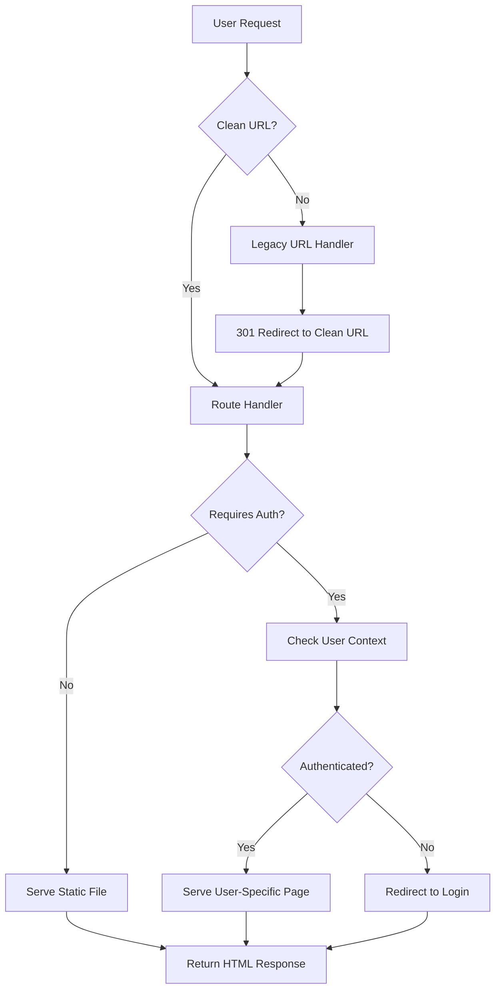

# Design Document: Clean URL Routing System

## Overview

This design implements a clean URL routing system for the J.A.I web application that replaces file-based URLs (e.g., `/login.html`) with user-friendly paths (e.g., `/login`). The solution leverages FastAPI's routing capabilities to create a mapping layer between clean URLs and HTML files while maintaining backward compatibility and supporting user-type-specific routing.

## Architecture

The clean URL routing system consists of three main components:

1. **URL Route Handlers**: FastAPI endpoints that map clean URLs to HTML files
2. **User Context Service**: Authentication-aware routing for user-specific pages
3. **Redirect Manager**: Handles backward compatibility by redirecting old URLs to new ones



## Components and Interfaces

### 1. Clean URL Route Handler

**Purpose**: Maps clean URLs to appropriate HTML files based on user context and authentication state.

**Interface**:
```python
@app.get("/{clean_path}")
async def handle_clean_url(
    clean_path: str,
    request: Request,
    user_context: Optional[UserContext] = Depends(get_current_user_optional)
) -> FileResponse
```

**URL Mappings**:
- `/` → `index.html`
- `/login` → `client-login.html` (default) or `lawyer-login.html` (if `?type=lawyer`)
- `/dashboard` → `client-dashboard.html` or `lawyer-dashboard.html` (based on user type)
- `/lawyers` → `lawyers.html`
- `/terms` → `terms.html`
- `/signup` → Redirect to `/login` with signup mode

### 2. User Context Service

**Purpose**: Determines user authentication state and type for routing decisions.

**Interface**:
```python
class UserContext:
    user_id: Optional[str]
    user_type: Optional[str]  # "client" or "lawyer"
    is_authenticated: bool

async def get_current_user_optional(request: Request) -> Optional[UserContext]
async def get_current_user_required(request: Request) -> UserContext
```

### 3. Legacy URL Redirect Handler

**Purpose**: Provides backward compatibility by redirecting old HTML file URLs to clean URLs.

**Interface**:
```python
@app.get("/{filename}.html")
async def redirect_legacy_url(filename: str, request: Request) -> RedirectResponse
```

**Redirect Mappings**:
- `/client-login.html` → `/login`
- `/lawyer-login.html` → `/login?type=lawyer`
- `/client-dashboard.html` → `/dashboard`
- `/lawyer-dashboard.html` → `/dashboard`
- `/lawyers.html` → `/lawyers`
- `/terms.html` → `/terms`

## Data Models

### URL Mapping Configuration

```python
@dataclass
class RouteConfig:
    clean_path: str
    html_file: str
    requires_auth: bool = False
    allowed_user_types: Optional[List[str]] = None
    redirect_if_unauthenticated: str = "/login"

# Route configuration mapping
ROUTE_MAPPINGS = {
    "/": RouteConfig("/", "index.html"),
    "/login": RouteConfig("/login", "client-login.html"),
    "/dashboard": RouteConfig("/dashboard", "client-dashboard.html", requires_auth=True),
    "/lawyers": RouteConfig("/lawyers", "lawyers.html"),
    "/terms": RouteConfig("/terms", "terms.html"),
}
```

### User Authentication Context

```python
@dataclass
class UserContext:
    user_id: Optional[str] = None
    user_type: Optional[str] = None
    email: Optional[str] = None
    is_authenticated: bool = False
    
    @property
    def is_client(self) -> bool:
        return self.user_type == "client"
    
    @property
    def is_lawyer(self) -> bool:
        return self.user_type == "lawyer"
```

## Correctness Properties

*A property is a characteristic or behavior that should hold true across all valid executions of a system-essentially, a formal statement about what the system should do. Properties serve as the bridge between human-readable specifications and machine-verifiable correctness guarantees.*

### Property Reflection

After analyzing the acceptance criteria, several properties can be consolidated to avoid redundancy:
- Properties 1.1, 1.3, and 1.4 all test basic URL-to-file mapping and can be combined into a single comprehensive property
- Properties 2.1 and 2.2 both test user-type-specific routing and can be combined
- Properties 3.1 and 3.2 both relate to redirect behavior and can be combined
- Properties 4.1 and 4.2 both relate to 404 error handling and can be combined

### Core Properties

**Property 1: Clean URL Mapping**
*For any* valid clean URL path in the route configuration, making a request to that path should serve the corresponding HTML file with correct content
**Validates: Requirements 1.1, 1.3, 1.4**

**Property 2: User-Type-Specific Dashboard Routing**
*For any* authenticated user with a valid user type (client or lawyer), navigating to `/dashboard` should serve the dashboard HTML file corresponding to their user type
**Validates: Requirements 2.1, 2.2**

**Property 3: Authentication-Based Access Control**
*For any* protected route, unauthenticated requests should result in a redirect to the login page
**Validates: Requirements 2.3**

**Property 4: User Context Extraction**
*For any* valid authentication token, the system should correctly extract and identify the user type from the authentication context
**Validates: Requirements 2.4**

**Property 5: Legacy URL Redirection**
*For any* legacy HTML file URL, the system should return a 301 redirect to the corresponding clean URL while preserving query parameters
**Validates: Requirements 3.1, 3.2, 3.3**

**Property 6: Static Asset Serving**
*For any* static asset request (CSS, JS, images), the system should serve the file normally without interference from clean URL routing
**Validates: Requirements 3.4**

**Property 7: 404 Error Handling**
*For any* non-existent URL path, the system should return a 404 status with a custom error page containing navigation options
**Validates: Requirements 4.1, 4.2**

**Property 8: Request Logging**
*For any* invalid URL request, the system should generate a log entry for monitoring purposes
**Validates: Requirements 4.3**

**Property 9: URL Suggestion**
*For any* invalid URL that is similar to a valid route, the system should provide suggestions for correct URLs
**Validates: Requirements 4.4**

**Property 10: HTTP Headers and Caching**
*For any* HTML file response, the system should include appropriate caching headers and SEO meta tags
**Validates: Requirements 5.1, 5.2**

**Property 11: HTTP Compression Support**
*For any* request that includes compression headers, the system should support and apply HTTP compression to responses
**Validates: Requirements 5.4**

<function_calls>
<invoke name="prework">
<parameter name="featureName">clean-url-routing

## Error Handling

### Authentication Errors
- **Unauthenticated Access**: Redirect to login page with return URL parameter
- **Invalid Token**: Clear authentication and redirect to login
- **Expired Session**: Refresh token or redirect to login with session expired message

### Route Resolution Errors
- **404 Not Found**: Serve custom 404 page with navigation and search suggestions
- **File Not Found**: Log error and serve 404 page
- **Invalid User Type**: Log warning and redirect to appropriate login page

### System Errors
- **Database Connection**: Graceful degradation with cached user context
- **File System Errors**: Log error and serve generic error page
- **Configuration Errors**: Log critical error and serve maintenance page

### Error Response Format
```python
@dataclass
class ErrorResponse:
    status_code: int
    message: str
    suggestions: List[str] = field(default_factory=list)
    redirect_url: Optional[str] = None
    timestamp: datetime = field(default_factory=datetime.utcnow)
```

## Testing Strategy

### Unit Testing Approach
- **Route Handler Tests**: Verify correct file serving for each clean URL
- **Authentication Tests**: Test user context extraction and validation
- **Redirect Tests**: Verify legacy URL redirects work correctly
- **Error Handling Tests**: Test 404 responses and error page content

### Property-Based Testing Configuration
- **Framework**: Use pytest with Hypothesis for property-based testing
- **Test Iterations**: Minimum 100 iterations per property test
- **Test Data Generation**: Generate random URLs, user contexts, and request parameters
- **Coverage**: Each correctness property implemented as a separate property-based test

### Integration Testing
- **End-to-End Flows**: Test complete user journeys from clean URLs to rendered pages
- **Authentication Integration**: Test with real JWT tokens and user sessions
- **Static Asset Integration**: Verify CSS, JS, and images load correctly with clean URLs
- **Browser Compatibility**: Test URL routing works across different browsers

### Performance Testing
- **Response Time**: Ensure clean URL routing doesn't add significant latency
- **Memory Usage**: Monitor memory consumption during route resolution
- **Concurrent Requests**: Test system behavior under high load
- **Caching Effectiveness**: Verify HTTP caching improves performance

### Test Tagging Format
Each property-based test must include a comment with the format:
**Feature: clean-url-routing, Property {number}: {property_text}**

Example:
```python
def test_clean_url_mapping_property():
    """
    Feature: clean-url-routing, Property 1: Clean URL Mapping
    For any valid clean URL path in the route configuration, 
    making a request to that path should serve the corresponding HTML file
    """
```