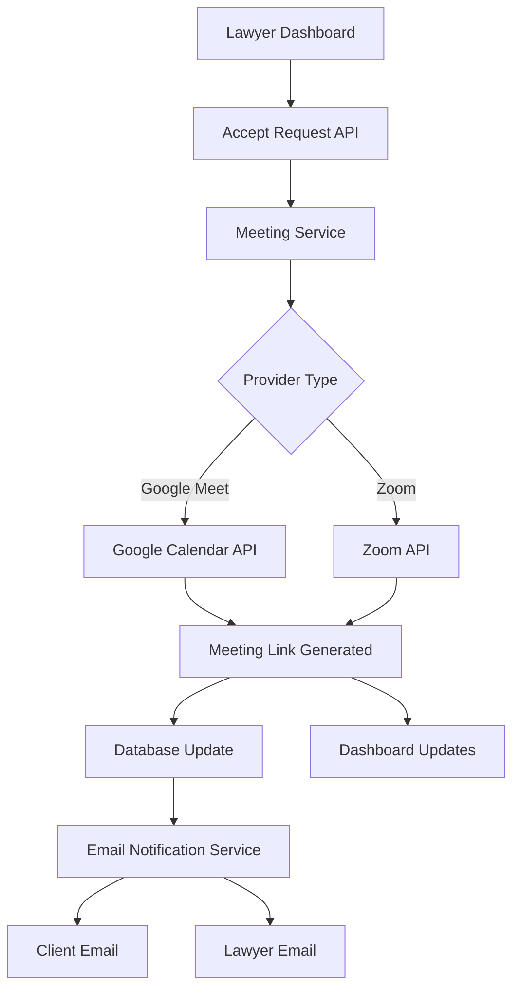

# Design Document: Meeting Link Generation

## Overview

This design implements automatic video meeting link generation for the J.A.I legal platform. When a lawyer accepts a client request, the system will automatically create a video conference meeting (Google Meet or Zoom) and distribute the meeting link to both parties. The solution integrates with the existing FastAPI backend and MongoDB database, extending the current lawyer request workflow.

## Architecture

The meeting link generation system follows a service-oriented architecture that integrates with the existing request handling system:



### Integration Points

- **Request System**: Extends the existing `/api/requests/{request_id}/respond` endpoint
- **Database**: Adds meeting link fields to the `lawyer_requests` collection
- **Email System**: Integrates with existing notification infrastructure
- **Frontend**: Updates client and lawyer dashboards to display meeting links

## Components and Interfaces

### 1. Meeting Service (`meeting_service.py`)

Core service responsible for creating and managing video meeting links.

```python
class MeetingService:
    def __init__(self, provider: str, config: dict)
    async def create_meeting(self, meeting_request: MeetingRequest) -> MeetingResponse
    async def cancel_meeting(self, meeting_id: str) -> bool
    async def get_meeting_details(self, meeting_id: str) -> MeetingDetails
```

### 2. Provider Interfaces

Abstract base class for video conferencing providers:

```python
class VideoProvider(ABC):
    @abstractmethod
    async def create_meeting(self, request: MeetingRequest) -> MeetingResponse
    
    @abstractmethod
    async def cancel_meeting(self, meeting_id: str) -> bool
```

**Google Meet Provider** (`google_meet_provider.py`):
- Uses Google Calendar API to create calendar events with Meet links
- Requires OAuth 2.0 authentication with calendar.events scope
- Automatically generates Meet links when creating calendar events

**Zoom Provider** (`zoom_provider.py`):
- Uses Zoom REST API to create meetings
- Requires JWT or OAuth 2.0 authentication
- Provides more granular meeting controls (waiting room, passwords)

### 3. Configuration Service

Manages provider selection and API credentials:

```python
class MeetingConfig:
    provider: str  # "google_meet" or "zoom"
    google_credentials: Optional[dict]
    zoom_credentials: Optional[dict]
    default_meeting_duration: int = 60
    buffer_time_minutes: int = 15
```

### 4. Enhanced Request Models

Extends existing `LawyerRequestInDB` model:

```python
class MeetingLink(BaseModel):
    meeting_id: str
    join_url: str
    host_url: Optional[str]
    provider: str
    created_at: datetime
    expires_at: Optional[datetime]
    meeting_password: Optional[str]

class LawyerRequestInDB(LawyerRequestBase):
    # ... existing fields ...
    meeting_link: Optional[MeetingLink] = None
    meeting_created_at: Optional[datetime] = None
```

## Data Models

### Meeting Request Data

```python
class MeetingRequest(BaseModel):
    title: str
    description: str
    start_time: datetime
    duration_minutes: int
    host_email: str
    attendee_emails: List[str]
    timezone: str = "UTC"
    meeting_type: str = "online"
```

### Meeting Response Data

```python
class MeetingResponse(BaseModel):
    meeting_id: str
    join_url: str
    host_url: Optional[str]
    start_url: Optional[str]  # For Zoom
    password: Optional[str]
    provider: str
    created_at: datetime
    expires_at: Optional[datetime]
```

### Database Schema Updates

**lawyer_requests collection** - Add new fields:
```javascript
{
  // ... existing fields ...
  "meeting_link": {
    "meeting_id": "string",
    "join_url": "string", 
    "host_url": "string",
    "provider": "google_meet|zoom",
    "created_at": "datetime",
    "expires_at": "datetime",
    "meeting_password": "string"
  },
  "meeting_created_at": "datetime"
}
```

**meeting_config collection** - New collection for configuration:
```javascript
{
  "_id": "ObjectId",
  "provider": "google_meet|zoom",
  "google_credentials": {
    "client_id": "string",
    "client_secret": "string", 
    "refresh_token": "string"
  },
  "zoom_credentials": {
    "api_key": "string",
    "api_secret": "string",
    "account_id": "string"
  },
  "settings": {
    "default_duration": 60,
    "buffer_time": 15,
    "enable_waiting_room": true,
    "require_password": false
  },
  "updated_at": "datetime"
}
```

Now I need to use the prework tool to analyze the acceptance criteria before writing the correctness properties:

<function_calls>
<invoke name="prework">
<parameter name="featureName">meeting-link-generation
## Correctness Properties

*A property is a characteristic or behavior that should hold true across all valid executions of a system-essentially, a formal statement about what the system should do. Properties serve as the bridge between human-readable specifications and machine-verifiable correctness guarantees.*

Based on the prework analysis, I've identified the following properties that can be tested through property-based testing. After reviewing for redundancy, I've consolidated related properties and eliminated overlapping validations.

### Property Reflection

After analyzing all acceptance criteria, several properties can be consolidated:
- Properties 1.1, 1.2, and 1.3 can be combined into a comprehensive meeting creation property
- Properties 2.2 and 2.3 are redundant - both test data availability for dashboards
- Properties 3.2 and 3.3 can be combined into provider-specific behavior testing
- Properties 4.1, 4.2, and 4.5 can be consolidated into meeting security and configuration
- Properties 5.1 and 5.4 overlap in email content validation

### Core Properties

**Property 1: Meeting Creation and Storage**
*For any* accepted lawyer request with a selected meeting slot, creating a meeting link should result in a valid meeting being generated, stored in the database with correct metadata (date, time, duration), and linked to the request record.
**Validates: Requirements 1.1, 1.2, 1.3**

**Property 2: Provider Selection and API Usage**
*For any* configured video provider (Google Meet or Zoom), the system should use the correct API endpoints and authentication methods specific to that provider when creating meetings.
**Validates: Requirements 1.5, 3.2, 3.3**

**Property 3: Meeting Security Configuration**
*For any* created meeting, the system should apply appropriate security settings including waiting room controls, set the lawyer as host, generate unique meeting IDs, and calculate correct expiration times based on duration plus buffer.
**Validates: Requirements 4.1, 4.2, 4.3, 4.5**

**Property 4: Email Notification Distribution**
*For any* generated meeting link, confirmation emails containing the meeting details should be sent to both the client and lawyer with all required information (link, date, time, joining instructions).
**Validates: Requirements 2.1, 5.1, 5.4**

**Property 5: Dashboard Data Availability**
*For any* request with a generated meeting link, the meeting information should be available in the API responses for both client and lawyer dashboard views.
**Validates: Requirements 2.2, 2.3, 2.4**

**Property 6: Configuration Management**
*For any* provider configuration change, the system should validate credentials, use the correct provider for subsequent meeting creation, and handle invalid credentials gracefully with appropriate error logging.
**Validates: Requirements 3.1, 3.4, 3.5**

**Property 7: Error Handling and Recovery**
*For any* meeting creation failure (API errors, network issues, invalid credentials), the system should log appropriate errors, notify the lawyer, and maintain system stability without corrupting request data.
**Validates: Requirements 1.4, 3.5**

**Property 8: Meeting Lifecycle Management**
*For any* meeting that is cancelled or needs regeneration, the system should properly invalidate old links, create new ones when requested, and maintain a complete history of all meeting links for each request.
**Validates: Requirements 4.4, 6.3, 6.5**

**Property 9: Calendar Integration**
*For any* meeting created, the system should generate proper calendar data (ICS format) that participants can use to add the meeting to their calendars with correct timezone and meeting details.
**Validates: Requirements 5.5**

**Property 10: Audit Trail Maintenance**
*For any* meeting-related action (creation, cancellation, regeneration), the system should store timestamps and maintain accurate meeting status tracking for historical reporting.
**Validates: Requirements 6.1, 6.4**

## Error Handling

### API Failure Scenarios

1. **Provider API Unavailable**
   - Implement exponential backoff retry logic
   - Store meeting creation requests for later retry
   - Notify lawyer of temporary failure with retry timeline

2. **Invalid Credentials**
   - Validate credentials during configuration
   - Prevent meeting creation with invalid credentials
   - Log security events for credential failures

3. **Rate Limiting**
   - Implement request queuing for API rate limits
   - Provide user feedback about delays
   - Cache meeting links to reduce API calls

### Database Failures

1. **Connection Issues**
   - Implement database connection pooling
   - Retry failed database operations
   - Maintain data consistency during failures

2. **Data Validation Errors**
   - Validate all meeting data before storage
   - Provide clear error messages for invalid data
   - Rollback partial updates on validation failures

### Email Delivery Failures

1. **SMTP Server Issues**
   - Queue failed email notifications for retry
   - Log email delivery failures
   - Provide alternative notification methods

2. **Invalid Email Addresses**
   - Validate email addresses before sending
   - Handle bounced emails gracefully
   - Update user records for invalid emails

## Testing Strategy

### Dual Testing Approach

The system will use both unit testing and property-based testing for comprehensive coverage:

**Unit Tests**: Focus on specific examples, edge cases, and integration points
- Test specific provider API integrations with mocked responses
- Verify email template generation with sample data
- Test error handling with specific failure scenarios
- Validate database operations with known test data

**Property-Based Tests**: Verify universal properties across all inputs
- Use Hypothesis (Python) for property-based testing framework
- Configure each test to run minimum 100 iterations for thorough coverage
- Generate random meeting requests, provider configurations, and user data
- Test properties across all supported providers and configurations

### Property Test Configuration

Each property-based test will:
- Run minimum 100 iterations to ensure comprehensive input coverage
- Use custom generators for realistic test data (valid email addresses, future dates, etc.)
- Include edge case generation (boundary dates, maximum duration meetings, etc.)
- Tag tests with format: **Feature: meeting-link-generation, Property {number}: {property_text}**

### Test Data Generation

**Smart Generators**:
- Meeting requests with realistic date/time combinations
- Valid email addresses and user profiles
- Provider configurations with both valid and invalid credentials
- Request data that matches existing database schema constraints

**Edge Case Coverage**:
- Meetings scheduled at timezone boundaries
- Maximum and minimum duration meetings
- Concurrent meeting creation requests
- Provider API timeout scenarios

### Integration Testing

**End-to-End Flows**:
- Complete request acceptance to meeting creation workflow
- Email delivery and dashboard update verification
- Provider failover and error recovery testing
- Database consistency during concurrent operations

**Performance Testing**:
- Meeting creation under high load
- Database query performance with large datasets
- Email queue processing efficiency
- API rate limit handling

The testing strategy ensures both specific functionality works correctly (unit tests) and universal properties hold across all possible inputs (property-based tests), providing comprehensive validation of the meeting link generation system.